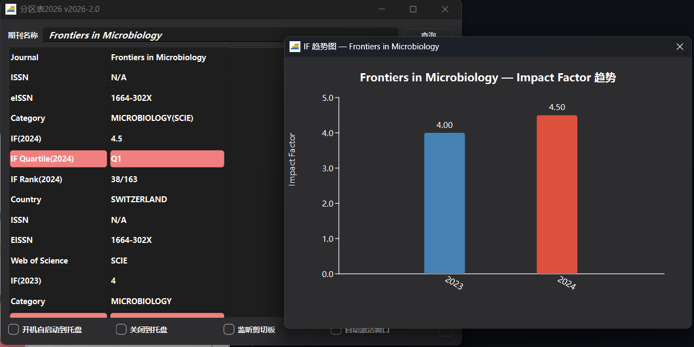

# ShowJCR Enhanced (v2026-2.0)

> 基于 [hitfyd/ShowJCR](https://github.com/hitfyd/ShowJCR) v2026-1.1 修改，原作者 hitfyd，GPL-3.0 许可。
> 
> 代码优化及功能开发使用 [Mimo](https://github.com/Xiaomi/mimo) 模型（小米 AI）辅助完成。

## 下载

| 平台 | 文件 | 说明 |
|---|---|---|
| Windows | `ShowJCR_v2026-2.0.zip` (27 MB) | 完整包，解压运行 |
| Windows | `ShowJCR_v2026-2.0_single.exe` (18 MB) | 单文件版，双击运行 |
| Android | `ShowJCR.apk` (10.9 MB) | 安装包 |

## Windows 功能

| 功能 | 说明 | 快捷键 |
|---|---|---|
| 模糊搜索 | 输入关键词匹配相关期刊 | — |
| 搜索历史 | 最近 10 次查询，菜单快速回查 | — |
| 收藏夹 | 标记常用期刊 | `Ctrl+D` |
| 批量查询 | 多期刊一次性查询，CSV 导出 | `Ctrl+B` |
| IF 趋势图 | 可视化对比各年影响因子 | `Ctrl+T` |
| CSV 导出 | 导出当前查询结果 | `Ctrl+E` |
| 深色模式 | 暗色主题切换 | 菜单 |
| 全局热键 | 任意窗口激活 | `Win+J` |

## Android 功能

| 功能 | 说明 |
|---|---|
| 期刊搜索 | 精确 + 模糊匹配 |
| 搜索历史 | 最近 20 条，点击快速查询 |
| IF 趋势图 | 柱状图可视化 |
| CSV 导出 | 导出并分享 |
| 批量查询 | 多期刊一次性查询 |
| 长按复制 | 长按结果行复制内容 |
| 索引缓存 | 首次建索引后缓存，二次启动加速 |

**IF 趋势图示例：**

## 代码优化

- 修复 SQL 注入（参数化查询）
- 修复内存泄漏
- 搜索 O(n²) → O(1)（Hash 索引）
- 新式信号槽、C++17

---

## 数据来源

| 数据 | 来源 | 版本 |
|---|---|---|
| 新锐期刊分区表 | [xr-scholar.com](https://www.xr-scholar.com) | 2026（22299 种期刊） |
| 中科院分区表升级版 | [advanced.fenqubiao.com](http://advanced.fenqubiao.com) | 2025 |
| JCR 影响因子 | — | 2024（保留 2023 对比） |
| 国际期刊预警名单 | [ewl.fenqubiao.com](https://ewl.fenqubiao.com/#/README) | 2020–2025 |
| CCF 推荐目录 | [ccf.org.cn](https://www.ccf.org.cn/Academic_Evaluation/By_category/) | 2026 |
| 高质量科技期刊分级 | [ccf.org.cn](https://www.ccf.org.cn/ccftjgjxskwml/) | 2025 |

**特殊情况：**
- ADVANCED ENGINEERING MATERIALS、Soft Science 有两个大类分区（材料科学、工程技术）
- AUSTRALASIAN PLANT PATHOLOGY、HEART RHYTHM 存在同名不同 ISSN 的期刊

## 导入新分区

在 `jcr.db` 中新增数据表即可，无需修改源码。使用 [DB Browser for SQLite](https://sqlitebrowser.org/) 导入 CSV。

**数据库表导入顺序：** JCR2024 → JCR2023 → GJQKYJMD2025/2024/2023/2021/2020 → CCF2026 → CCFT2025 → XR2026 → XR2026Conferences → FQBJCR2025

**表字段要求：** 必须包含 `Journal` 字段（默认搜索字段）。若 `Journal` 不是首列，其前方列也作为搜索字段。

格式一：`Journal` 为首列

| Journal | IF(2021) |
|---|---|
| PROCEEDINGS OF THE IEEE | 14.91 |

格式二：`Journal` 为第二列

| 刊物简称 | Journal | 领域 | CCF推荐类型 |
|---|---|---|---|
| Proc. IEEE | Proceedings of the IEEE | 交叉/综合/新兴 | A类 |

## 运行依赖

1. `jcr.db` — 放在 exe 同目录
2. Qt 依赖 — 已随 exe 打包

## 使用说明

输入期刊名称，点击"查询"或按回车即可。

- 年份字段：浅灰色分隔不同数据源
- IF、预警、大类分区、Top：红色标记重要信息
- 输入框支持联想，不区分大小写

**底部选项：**

| 选项 | 功能 |
|---|---|
| 开机自启动到托盘 | 开机后台运行 |
| 退出到托盘 | 关闭窗口不退出 |
| 监听剪切板 | 复制期刊名自动查询 |
| 自动激活窗口 | 查询后窗口置顶 |

